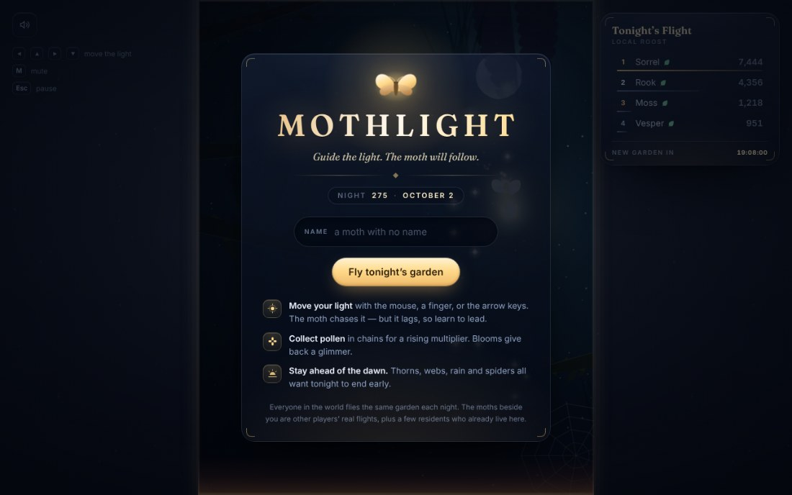
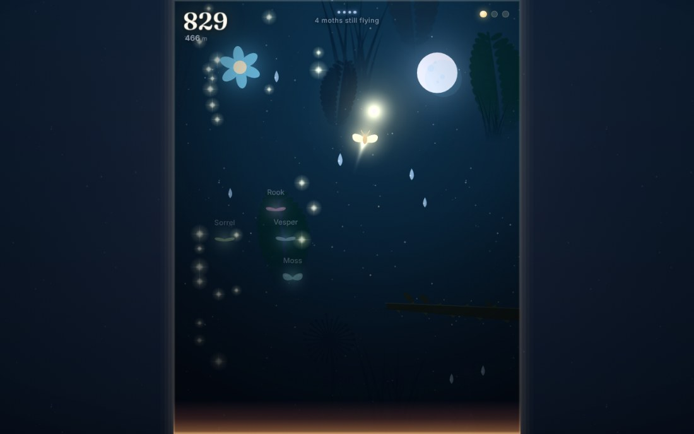
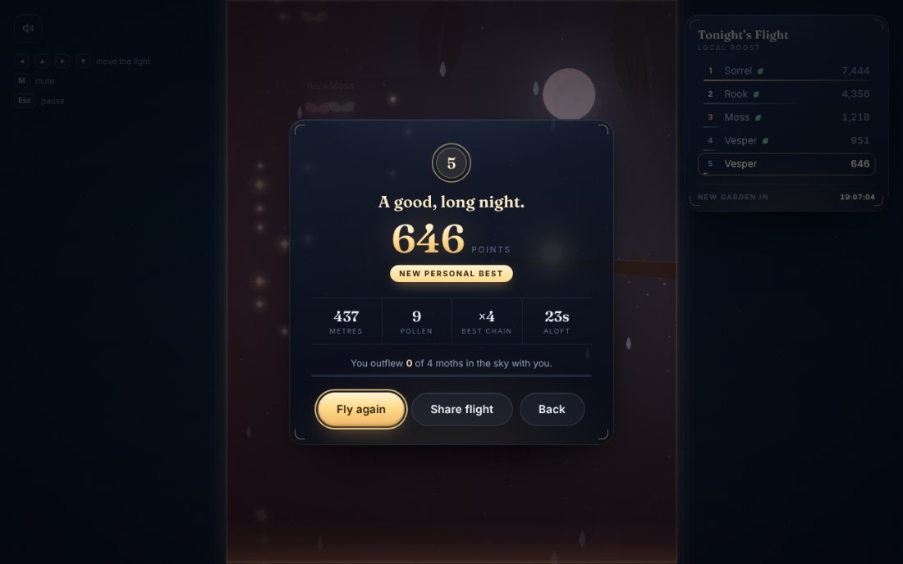
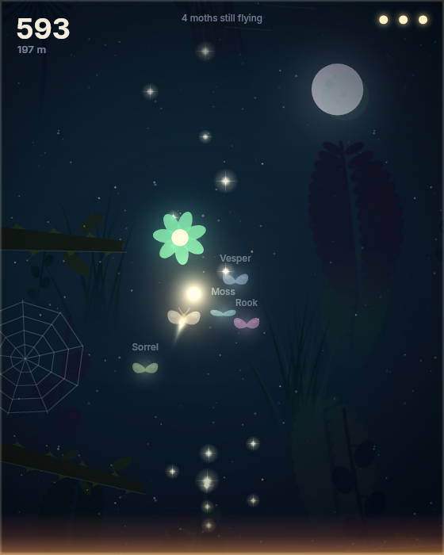
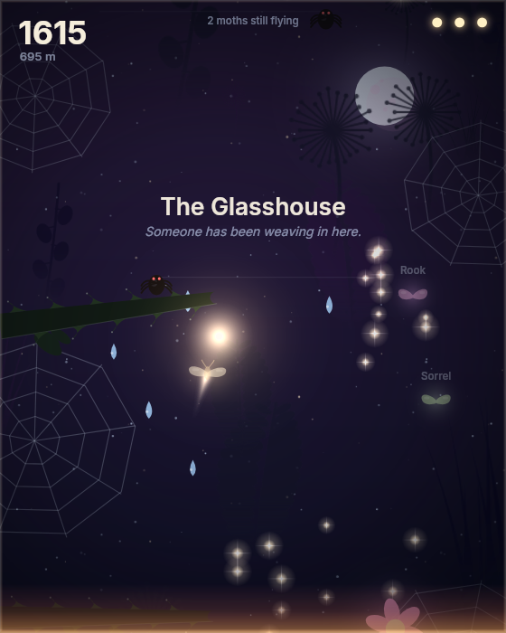
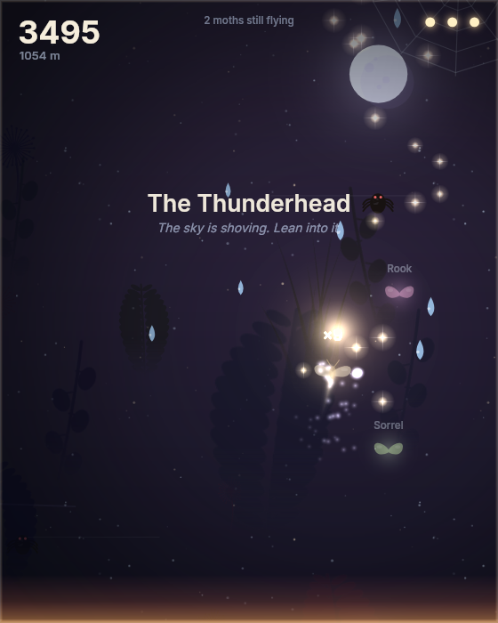
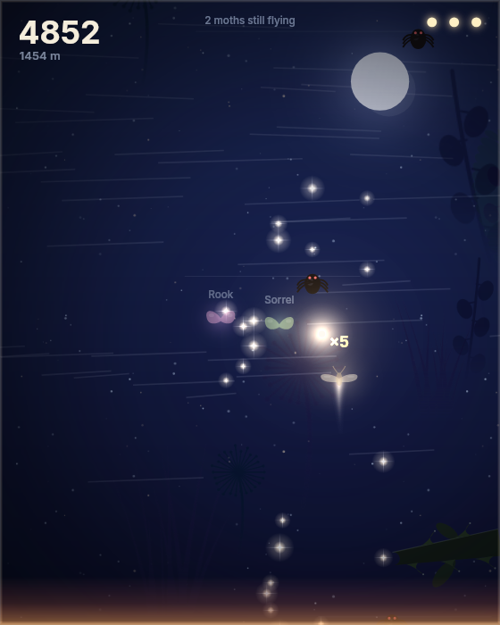
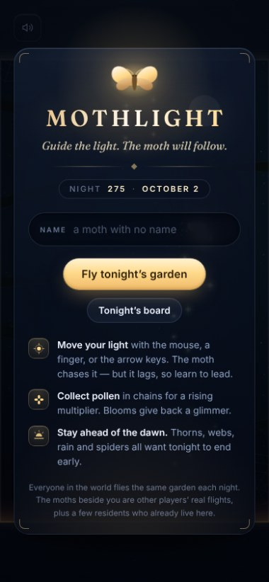

<div align="center">


# MOTHLIGHT

### *Guide the light. The moth will follow.*

A new night garden grows every day — the same one for everybody on earth.
Lead a moth through thorns, webs, rain and spiders by moving your light, and
race the ghosts of everyone else who flew tonight.

**~28 KB over the wire. No download, no sign-up, no loading screen.**
Runs on nothing but Vercel and a Neon database.

</div>

---

## The hook

You don't control the moth. **You control the light.**

The moth is attached to your cursor by an underdamped spring, so it lags,
overshoots and swings. Every thorn you squeeze past is a small act of
anticipation — you have to steer where the moth *will* be, not where it is.
It takes ten seconds to understand and a long time to be good at.

Underneath that there are three ideas doing the heavy lifting:

| | |
|---|---|
| **One garden a night** | The whole level is generated from a 10-character date string. Everyone in the world flies the identical garden, it resets at UTC midnight, and there is a countdown on screen. A reason to come back tomorrow, and a reason to compare. |
| **Ghost moths** | The dawn rises on a fixed curve nobody can influence, so *seconds since launch* and *altitude* are the same thing. That means a recorded flight path replays in perfect sync with your own — other players' moths fly beside you, hit the same brambles, and drop out of the sky one by one as their runs end. Last one flying wins the night. Zero websockets. |
| **Nobody flies alone** | Opening night with an empty leaderboard is death for a social game. Every garden ships with a few *residents* — deterministic moths generated from the same daily seed, identical for everyone — who quietly make room as real players arrive. |

---

## Screens

<div align="center">







</div>

| The Hedgerow | The Glasshouse |
|---|---|
|  |  |
| **The Thunderhead** | **The Moonfield** |
|  |  |

Five biomes rotate as you climb, each with its own palette, hazard mix and
one line of text.

---

## The interface

There are no images in this interface. Not one — no icon font, no sprite
sheet, no UI framework. Every panel, bead, dial and medal is layered
gradients, hairline borders, backdrop blur and one procedural grain, which
is why a game that looks like this still costs 28 KB.

<div align="right"></div>

**The HUD belongs to the field, not the window.** The engine reports the
exact rectangle of the letterboxed play-field on every resize, and the HUD
is positioned on it and sized in world units — so the score sits in the same
place relative to the garden on a phone as on an ultrawide. But it is *DOM
text*, rendered at full device resolution, so it never looks like canvas
type that has been scaled up. It is the only part of the game that is not
drawn on the canvas, and that is deliberate.

Things worth noticing:

- **The light is the chrome.** Gold appears only on what you should look at
  or touch: the play button, your own row on the board, a lit glimmer.
- **Glass, not walls.** Every panel is translucent and blurs the garden
  behind it. The attract-mode moth keeps flying behind the title card and
  its glow blooms through the glass.
- **The combo is a dial that drains**, so you can feel a chain running out
  without reading a number.
- **Ghost pips go dark one at a time** as other players' runs end — the
  battle-royale tension of "7 moths still flying" with no server involved.
- **The dawn meter only exists when the dawn is actually on you**, and the
  whole window warms and tightens with it.
- **The score tallies up** on the result card rather than appearing, and
  your medal shows the same rank the leaderboard beside it is showing.

---

## How it plays

- **Move your light** — mouse, finger, or arrow keys / WASD. The moth chases it.
- **Collect pollen** in unbroken chains for a multiplier up to ×9.
- **Blooms** give back a lost glimmer. You have three.
- **Thorns, raindrops and spiders** cost a glimmer. **Webs** don't hurt — they
  just hold you still while the dawn keeps climbing, which is worse.
- **Gusts** shove you sideways. Lean into them.
- **Stay ahead of the dawn.** It accelerates forever. You will not win.

`Esc` abandons a run · `M` mutes · `Enter` flies again.

---

## Why it's fast

Most of the work here went into *not shipping things*.

| | |
|---|---|
| **Total first load** | **~28 KB gzipped** (18.7 KB JS + 9.8 KB HTML with CSS inlined) |
| **Framework runtime** | none — zero React, zero hydration, zero client router |
| **Images** | none. Every pixel is drawn procedurally into cached offscreen canvases at boot |
| **Audio files** | none. Every pad, pluck and gust is synthesised with Web Audio in a D-major pentatonic, so it can't play a wrong note |
| **Fonts** | 2 self-hosted latin-subset woff2 files, preloaded, same origin |
| **Network during play** | one `GET /api/ghosts` before launch. That's the entire multiplayer layer |
| **First paint** | the title card is in the HTML. It's on screen before a byte of JavaScript is parsed |

For comparison, the same game built as a conventional Next.js + React page
was **198 KB** — 165 KB of that was framework. Next.js is still in this repo,
but only for the three things it's genuinely best at here: API routes, the
generated OG image, and the Vercel pipeline. The game page itself is a static
document built by [`scripts/build-client.mjs`](scripts/build-client.mjs) and
served from `/public`.

In the hot render loop there are **no** gradients, no `shadowBlur`, no
filters and no allocations — only `drawImage` and `fillRect` against sprites
baked once at boot. Particles are pooled, the moth's trail is a ring buffer,
and the simulation runs on a fixed 120 Hz accumulator so physics is identical
on a 60 Hz laptop and a 144 Hz monitor. That last part isn't vanity: the
leaderboard is global, and ghosts have to line up.

---

## Deploy it

Three steps, two of them optional.

```bash
# 1. deploy
vercel

# 2. (optional) add a database — Vercel's Neon integration sets DATABASE_URL,
#    or paste your own connection string from https://neon.tech
vercel env add DATABASE_URL

# 3. there is no step 3. The schema creates itself on the first request.
```

**With no database the game is still completely playable.** Scores live in
`localStorage`, the leaderboard shows your own best alongside the garden's
residents, and every API route degrades quietly to offline mode. That's
deliberate: a missing env var should never be a blank screen.

### Cost

One table, one index, rows of about 4 KB (a 90-second flight compresses to
roughly 4 KB of delta-encoded positions). The leaderboard is cached at the
edge for 10 seconds and ghosts for 20, so a traffic spike hits the CDN, not
Neon. `prune()` in [`lib/db.ts`](lib/db.ts) drops nights older than a week.
This fits inside free tiers with room to spare.

---

## Running it locally

```bash
npm install
npm run dev          # builds the client bundle, then starts Next on :3000
```

| script | what it does |
|---|---|
| `npm run dev` | build the static game page, then `next dev` |
| `npm run build` | same, then `next build` |
| `npm run watch` | rebuild the game bundle on change |
| `npm run typecheck` | `tsc --noEmit` |
| `npm test` | engine harness + jsdom UI smoke test + database checks |
| `npm run test:db` | run every SQL query against Postgres-in-WASM |
| `npm run shots` | screenshot the interface in real Chromium |

### Testing a canvas game

Four harnesses, none of which need a human to look at anything:

- **[`scripts/harness.ts`](scripts/harness.ts)** stubs the DOM, boots the real
  engine in Node and flies it with an autopilot — proving a full run never
  throws, that the garden is deterministic, that replays round-trip, and that
  the server's anti-cheat bounds accept honest flights and reject tampered ones.
- **[`scripts/dom-smoke.ts`](scripts/dom-smoke.ts)** loads the *actual generated
  HTML* into jsdom and drives it like a player: click play, fly, die, read the
  result card, go back. It catches missing element ids and broken transitions.
- **[`scripts/db-check.ts`](scripts/db-check.ts)** runs every query in
  [`lib/db.ts`](lib/db.ts) — schema, ranking, `DISTINCT ON`, pruning — against
  Postgres compiled to WASM, in-process. No Neon account, no network, and it
  proves a recorded replay survives the round trip through the database.
- **[`scripts/shot.ts`](scripts/shot.ts)** renders real engine frames to PNG
  with `@napi-rs/canvas` — how the biome screenshots were made, and how the
  art direction gets reviewed.
- **[`scripts/uishot.mjs`](scripts/uishot.mjs)** drives the *interface* in
  real headless Chromium against a running server, and can act out a whole
  flight before it takes the shot:

  ```bash
  npm i --no-save puppeteer-core @sparticuz/chromium   # ~70 MB, not a dependency
  npm start &
  node scripts/uishot.mjs / docs/ui-title.jpg 1280 800
  ```

  Those two packages are deliberately kept out of `package.json` so nobody
  pays 70 MB to build a 28 KB game.

---

## How it's put together

```
game/            the engine — framework-free TypeScript, runs anywhere
  config.ts        tuning constants, biomes, and the dawn curve
  rng.ts           seeded PRNG + the daily seed
  world.ts         procedural garden: chunks, hazards, treasure
  engine.ts        fixed-step simulation + the renderer
  sprites.ts       every sprite, baked once at boot
  audio.ts         the entire soundtrack, synthesised
  ghost.ts         replay recording, encoding, playback
  residents.ts     the moths who already live in tonight's garden
src/             the UI — plain DOM, no framework
  ui.ts            screens, leaderboard, sharing
  styles.css       inlined into the page at build time
app/api/         three route handlers (leaderboard, ghosts, run)
lib/             Neon over HTTP + server-side validation
scripts/         the client build, and three headless test harnesses
```

### The anti-cheat

You can't fully stop a determined cheater without simulating the run on the
server. What you *can* do is make every physically impossible score bounce.
Because the dawn curve is a closed form, "how high could anyone possibly be
after N seconds" has an exact answer, and
[`lib/validate.ts`](lib/validate.ts) checks the altitude, the pollen count,
the arithmetic of the score, the combo ceiling, and whether the attached
replay is a real flight of the right length. Honest runs pass; inflated ones
get a 400.

### Deliberate trade-off worth knowing about

The play column is always exactly 720 world units wide on every device,
because horizontal room is what dodging actually costs. How much garden you
can see *vertically* flexes between 900 and 1240 units depending on your
screen's aspect ratio. A tall phone therefore gets a little more warning than
an ultrawide — which, given how much less precise a thumb is than a mouse,
lands about right. Locking it would have meant letterboxing a third of a
phone screen, and that was worse.

---

## Press kit

| | |
|---|---|
| **Name** | MOTHLIGHT |
| **Tagline** | Guide the light. The moth will follow. |
| **Pitch** | A new night garden grows every day, the same one for everyone. Fly it before the dawn catches you. |
| **Genre** | Cozy arcade · daily challenge · asynchronous multiplayer |
| **Platform** | Any browser. Mouse, touch or keyboard. |
| **Price** | Free |
| **Key art** | [`docs/key-art.jpg`](docs/key-art.jpg) |
| **Screens** | [`docs/`](docs/) |
| **Share card** | generated nightly at `/opengraph-image` |

> You don't control the moth. You control the light. It follows — but it
> lags, and it overshoots, and learning to lead it is the whole game. Every
> night a new garden grows, identical for every player in the world, and the
> moths flying beside you are real recorded flights from real people. They
> drop out of the sky one by one as their runs end. Be the last light.

---

<div align="center">
<sub>Built to be lovely, and to load before you finish reading this sentence.</sub>
</div>
