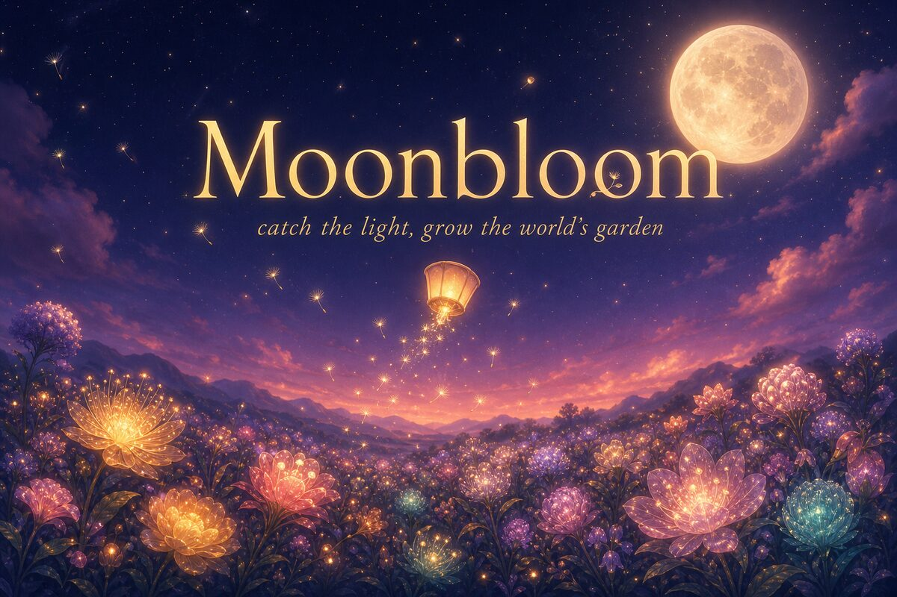

# 🌙 Moonbloom

**Catch the light. Grow the world's garden.**



Moonbloom is a tiny, lovely, lightning-fast browser arcade game. You guide a paper
lantern through the dusk, catching falling seeds of light while dodging thorns,
trying to survive until dawn. Every seed you catch **grows a glowing flower at your
feet in real time** — and when your run ends, your best flower is **planted in the
World Garden**: a persistent, shared meadow grown by every player on Earth.

Everyone plays the **same sky every night** (a deterministic daily seed, Wordle-style),
competes on tonight's leaderboard, and shares an emoji result card. New sky at midnight UTC.

## Why it's lightning fast

- **Zero framework, zero build step, zero image assets.** One HTML page, one CSS
  file, one JS file. All art is procedural canvas; all sound is procedural WebAudio.
  The whole game is ~40 KB of hand-written code and loads in milliseconds.
- **Two serverless functions** (`/api/scores`, `/api/garden`) on Vercel, talking to
  **Neon Postgres** over its HTTP serverless driver — no connection pools, no cold-start pain.
- Works **fully offline / without a database** too (in-memory fallback), so local dev
  is instant: `npm run dev`.

## Deploy (Vercel + Neon, ~3 minutes)

1. **Neon** → create a project, copy the connection string.
2. **Vercel** → `vercel` (or import the repo in the dashboard). No config needed —
   static files + `/api` are picked up automatically.
3. Add the env var in Vercel: `DATABASE_URL = postgres://...` (your Neon string).
4. Done. Tables (`mb_scores`, `mb_flowers`) auto-create on first request.

Local development:

```bash
npm install
npm run dev                       # in-memory store
DATABASE_URL=postgres://... npm run dev   # against real Neon
```

## Game design

| System | Detail |
| --- | --- |
| **Run** | 150 seconds; the sky slowly brightens from indigo night to rose dawn as you play |
| **Seeds of light** | +10 each, +2 per chain link; rare colored seeds ×5 and grow rarer flowers |
| **Chains** | Consecutive catches raise a combo; your flowers grow bigger and gain more petals |
| **Thorns** | Cost one of 3 petals; green dew drops restore them |
| **Dawn bonus** | Survive to dawn: +250 per remaining petal, and a little sunrise chord plays |
| **Zen Garden** | No thorns, no score, no clock — just catching light and growing flowers |
| **World Garden** | Drag through an endless meadow of real players' flowers, names and messages |

## Marketing kit (it's advertisable out of the box)

- **Tagline:** *Catch the light. Grow the world's garden.*
- **One-liner:** A 90-second nightly ritual — same sky for everyone, a flower from
  every player, forever.
- **Hooks:** daily seed + leaderboard (comeback loop) · emoji share card (viral loop)
  · persistent communal garden (emotional loop: *"my flower lives there"*).
- `og.jpg` social card, Open Graph + Twitter meta tags, and a one-tap share button
  are already wired in.
- **Sample post:** 🌙 Moonbloom — Night #7 · ✨ 2,340 light · ×18 chain ·
  🌸🌸🌸🌸 41 flowers grown

## Stack

- Front end: vanilla ES modules, Canvas 2D, WebAudio, Google Fonts (Fraunces)
- Back end: Vercel serverless functions (Node ESM)
- Database: Neon Postgres via `@neondatabase/serverless`
- Anti-mischief: server-side clamping, name/message sanitization, score caps
